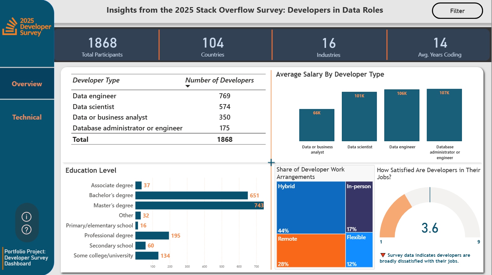
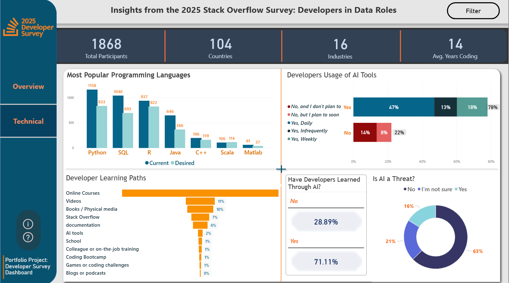

# Power BI Dashboard: 2025 Stack Overflow Developer Survey Analysis

## Overview
I developed a fully interactive Power BI dashboard leveraging the 2025 Stack Overflow Developer Survey. The dashboard provides a deep dive into data-focused careers, enabling exploration of learning paths, tools, demographics, and career trends within the developer community.

## Data Source
The analysis is based on the 2025 Stack Overflow Developer Survey, an annual survey conducted by Stack Overflow that captures insights from thousands of developers worldwide.

## What the Dashboard Does
- Provides an interactive interface to explore the 2025 Stack Overflow Developer Survey focused on data roles.

- Lets users filter by demographics, technologies, job roles, etc.

- Visualizes trends in salaries, programming languages, ai preferences, and developer demographics.

- Offers drill-through so you can view related insights.

## Dashboard Link & Preview
🔗 [Power BI Dashboard](https://tinyurl.com/n79978rw)

## Technical details
- **Tool:** Power BI
- **Dataset:** 2025 Stack Overflow Developer Survey

